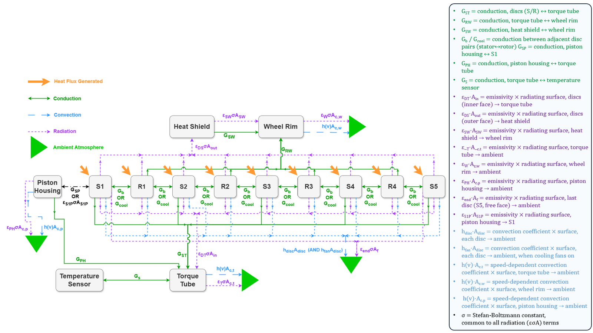
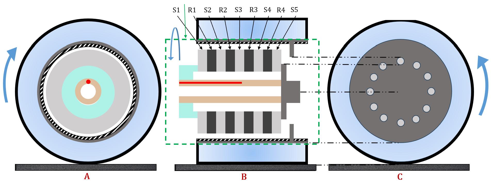
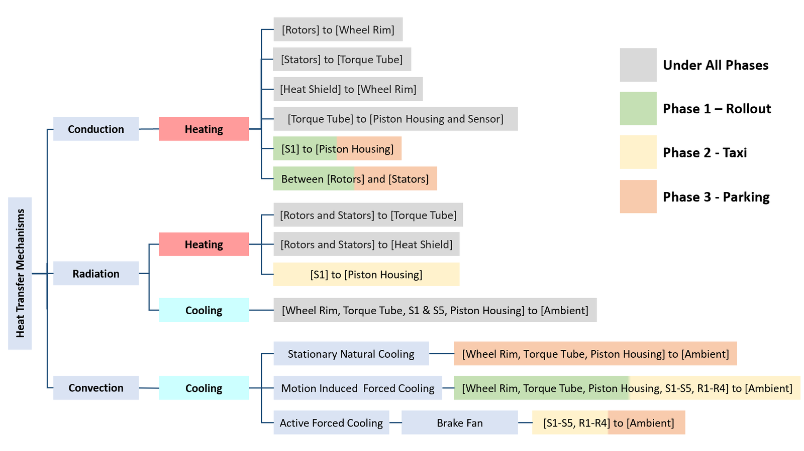

# BTEM: lumped-parameter brake temperature model (sanitized public release)

A 14-node lumped-parameter thermal model of an aircraft wheel and brake assembly, with a full calibration and prediction pipeline: automatic flight segmentation from CSV, robust touchdown detection, kinematic braking-energy reconstruction, multi-start Nelder-Mead calibration, full-day prediction with a sensitivity envelope, as a command line tool and a Streamlit app.



Developed within my Master's thesis with Airbus and Cranfield University (*Physics-Based Lumped-Parameter Thermal Modelling of Aircraft Wheel Assembly to Estimate Brake Temperature on an In-Service A320*, supervised by Dr Fakhre Ali). **This is a sanitized release**: every calibrated parameter value has been replaced by a generic placeholder, and every flight identifier, timestamp and path by an example. No flight data, no fitted values, no derived quantities from confidential data are included. The pipeline is designed to calibrate itself on whatever data you feed it.

## Layout

```text
.
├── btem_v5_full_flight.py           # The physics: 14-node thermal model, phases, ODE integration
├── btem_pipeline_with_eps_T.py      # Calibration pipeline (single source of truth)
├── predict_day_from_csv.py          # Generalist CLI: segmentation, calibration, full-day prediction
├── app.py                           # Streamlit application on top of the pipeline
├── calibrate_all_with_eps_T.py      # Batch calibration over flights and wheels
├── compare_landing_taxi_energy.py   # Kinematic energy reconstruction vs torque comparison
├── illustrate_core_second_anchor.py # Calibration anchor illustration
├── plot_all_nodes_day.py            # All-node temperature plots over a day
├── docs/                            # Methodology schematics from the thesis (no data plots)
├── examples/generate_synthetic_csv.py # Generates a non-scientific input-format demo
├── requirements.txt                 # Python dependencies
├── docs/usage.md                    # Quick-start input schema and CLI guide
└── docs/usage-reference.txt         # Complete technical operating reference
```

A quick-start guide is in [docs/usage.md](docs/usage.md), with the complete
technical reference preserved in [docs/usage-reference.txt](docs/usage-reference.txt).

## Run it

```bash
python -m venv .venv
source .venv/bin/activate  # Windows: .venv\Scripts\activate
pip install -r requirements.txt
streamlit run app.py
```

Feed it a flight CSV (ground speed, radio altitude, brake temperature, gross weight); the pipeline segments, calibrates and predicts.

To inspect the expected CSV structure without proprietary data:

```bash
python examples/generate_synthetic_csv.py
python predict_day_from_csv.py --csv examples/synthetic_day.csv --check-segmentation
```

The generated series is only an ingestion and interface demo. It is not an A320 validation dataset and must not be used to assess model accuracy.

## Gallery

| | |
|---|---|
|  |  |

All figures are methodology schematics from the thesis; no data plots are included.

## Companion project

The physics-informed neural network counterpart, on synthetic data: [pinn-brake-stack](https://github.com/ugo-roccamatisi/pinn-brake-stack). More on my [portfolio](https://ugo-roccamatisi.github.io).

## Licence

The source is published for technical review. See [LICENSE](LICENSE): no reuse or redistribution permission is granted without written authorisation.
